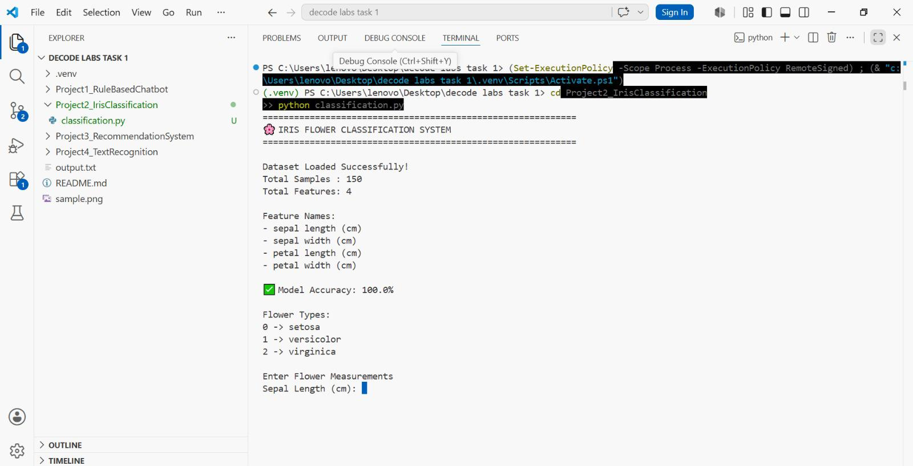
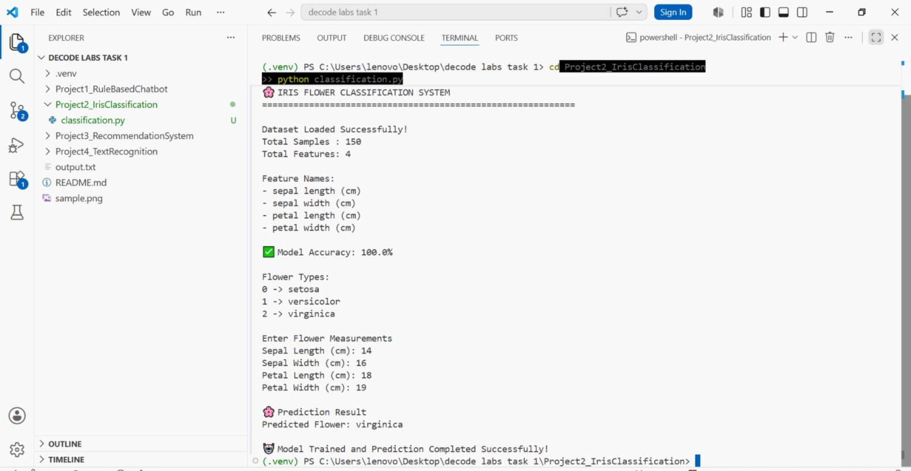

🌸 Iris Flower Classification System

📌 Project Overview

This project is a Machine Learning based Iris Flower Classification System developed using Python and Scikit-learn. The model is trained using the Iris dataset and predicts the species of a flower based on its measurements.

✨ Features

- Iris Dataset Loading
- Data Preprocessing
- Train-Test Split
- Decision Tree Classifier
- Model Training
- Accuracy Evaluation
- Flower Species Prediction

🛠 Technologies Used

- Python
- Scikit-learn

🚀 How to Run

1. Open the project folder.
2. Open Terminal or Command Prompt.
3. Run the following command:

python classification.py

🌸 Iris Flower Types

- Setosa
- Versicolor
- Virginica

📷 Screenshots

### Program Execution

### Prediction Result

🎯 Learning Outcomes

- Understanding Machine Learning Concepts
- Working with Datasets
- Model Training and Testing
- Classification Algorithms
- Prediction using User Input

👩‍💻 Author

MD Ramla Fathima
AI & DS
DecodeLabs AI Internship
