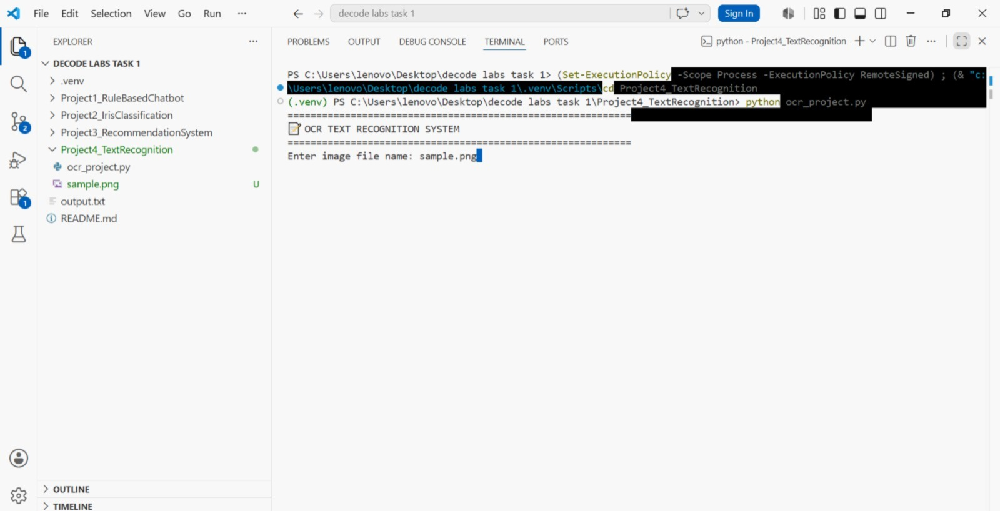
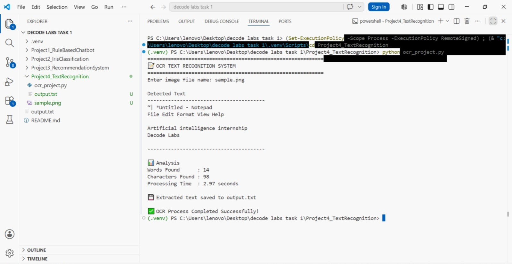

📝 OCR Text Recognition System

📌 Project Overview

This project is an OCR (Optical Character Recognition) based Text Recognition System developed using Python. The system extracts text from an image and saves the recognized text into a text file.

✨ Features

- Image Input Support
- Text Extraction from Images
- OCR using Tesseract
- Output File Generation
- Interactive Console Interface

🛠 Technologies Used

- Python
- Pytesseract
- Pillow (PIL)

🚀 How to Run

1. Open the project folder.
2. Install Tesseract OCR.
3. Open Terminal or Command Prompt.
4. Run the following command:

python ocr_project.py

📂 Files Included

- ocr_project.py
- sample.png
- output.txt

📷 Screenshots

## Input Screenshot

## Output Screenshot

🎯 Learning Outcomes

- Understanding OCR Technology
- Image Processing Basics
- Text Extraction from Images
- File Handling in Python
- Working with External Libraries

👩‍💻 Author

MD Ramla Fathima
AI & DS
DecodeLabs AI Internship
